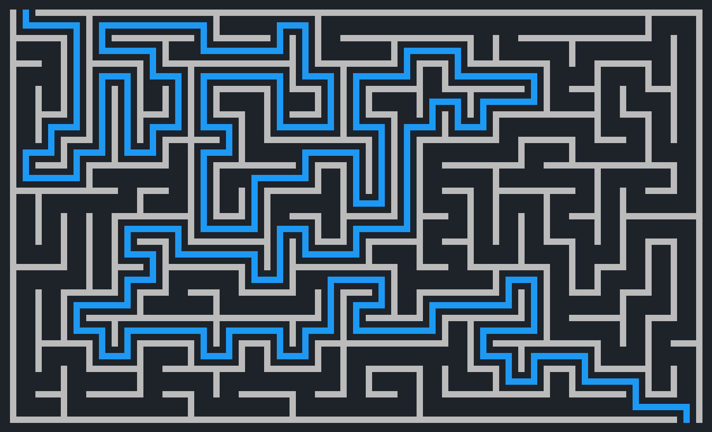

#Maze


##Maze generation and solving 



##Usage
```
m = maze(55, 33)		# create maze with 55 x 33 cells
m.generate()
m.show()				# display maze
						# ! maze has to be generated
m.solve()				
m.show(m.solution)		# show maze with solution
						# ! maze has to be solved
print(m.solution)		# print text solution
```


##Interactive mod
```
m = maze(55, 33)		
m.generate(0.03)		# draw generation step with 0.03 sec delay
m.solve(0.3)			# draw solving step with 0.3 sec delay
```

##Generation with "recursive backtracker" algorithm


##Solution with BFS algorithm

